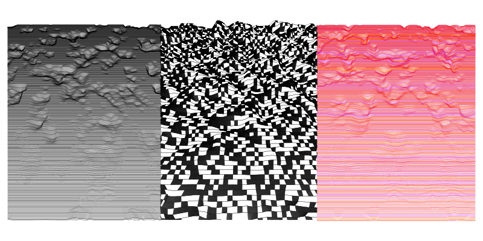
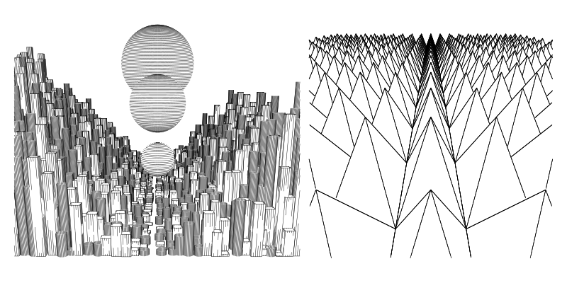
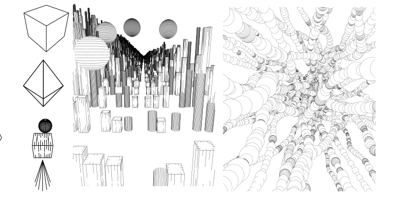

# Viewport.js

Viewport is a vector-based 3D renderer written in javascript. It is used to produce vector graphics like SVGs depicting 3D scenes.



Viewport is a port or translation of [Ln](https://github.com/LoicGoulefert/ln), a 3d line art render engine originally developed by Michael Fogleman and expanded upon by Loic Goulefert written in Go. 

I ported this library to javascript for myself to use and I thought it would be a good way to "learn" some Go. 

This library is intended for plotter artists mostly, but anyone who needs to output an SVG made of lines in a 3D scene could benefit. 


Some primitives can be added in simple line art, or with more complex shading. 
- Sphere ⚽
- Cube, 🎲
- Cone,  🎄
- Cylinder, 🛢️
- Shard -- like a diamond ♦️
- Mesh - Obj and STL support. 

Some utilites are included and required for use such as a simple Vector and matrix math. 


If you want to draw your own paths, you can override  Primitive.prototype.paths() or edit the source file. 

Meshes can be added as OBJ, STL, or just by making yuour own triangles. 

[Documentation](https://robmakesthings.github.io/Viewport.js) is available. I tried to document anything an artist would expect to work with. 

Examples are available to in the example directory, but to setup a scene, it only takes a dozen lines of code as outlined below.  It works with p5.js as a canvas but is mainly designed to output SVG's for later plotting. 

## Getting started
````
<script type="module" src="yourSketch.js"></script>
```` 
yourSketch.js
````
import { Scene, Cube,Vector} from "../src/viewport.js";

let scene = new Scene()
let center = new Vector(0, 0, 0)
let up = new Vector(0, 0, 1)
let eye = new Vector(3, 3, 3)
let cube = new Cube()
let w= 250; let h = 250;
scene.add(cube)
let paths = scene.render(eye, center, up, w, h, fovy, 0.01, 100,0.1)
paths.pathsToSVG()

````
The easiest way to place a shape where you want to put it is with the Transformed shape class. This allows you to place any object that assumes its drawn at 0,0 , such as a cylinder, and transform it anywhere in 3d space. 

````
let matrix = Translate(new Vector(-3,0,0))/// translate a shape 3 units to the left
matrix = matrix.rotate(up,radians(45))// rotate matrix 45 degrees on z axis
cube = new TransformedShape(cube,matrix)
scene.add(cube)
````




 


# Todo list 

- Mesh Primitives
- contains functions on existing non mesh primitives
- Constructive solid geometry with mesh based trees
- good support for colors
- speedups of tree/collision calcs with WASM/web workers
- P5 geometry object compatibility
- line overlap limits. 
- more paths/shading styles 

# Known issues
- Complex scenes/mesh objects hit errors with stack count in chrome. Mesh such as the famous teapot can recreate the. 
- constructive solid geometry is not working correctly. Some paths are duplicated. 


